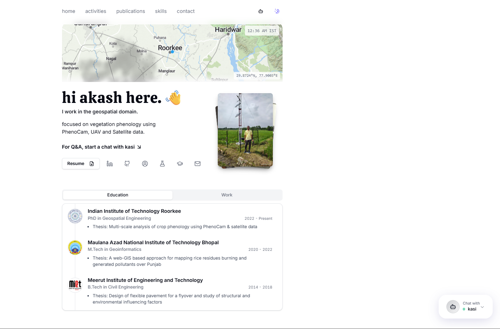

# akashpandey.com

My personal portfolio website built with Next.js, Tailwind CSS, and Shadcn UI. Features an AI chatbot, email contact form, and blog.

## Live

🌐 **[akashpandey.com](https://akashpandey.com)**



## Features

- Minimal design with Shadcn UI
- Light/dark mode toggle
- AI chatbot trained on portfolio content
- Contact form with email integration
- Responsive mobile design
- Blog section

## Tech Stack

- Next.js
- Tailwind CSS
- Shadcn UI
- OpenAI API (chatbot)
- Vercel (hosting)
- Resend (email)

## Getting Started

```bash
git clone https://github.com/ItsAkashPandey/akashpandey.com.git
cd akashpandey.com
npm install
cp .env.example .env.local
# add your API keys to .env.local
npm run dev
```

## Environment Variables

See .env.example

## Customization

- Update personal info in `src/data/*.json`
- Replace your resume with `public/resume.pdf`
- Modify chatbot prompt in `src/app/api/chat/route.ts`

## Deployment

Deploy with [Vercel](https://vercel.com/):

1. Push to GitHub
2. Connect repo to Vercel
3. Add environment variables
4. Deploy 🎉

## License

MIT
