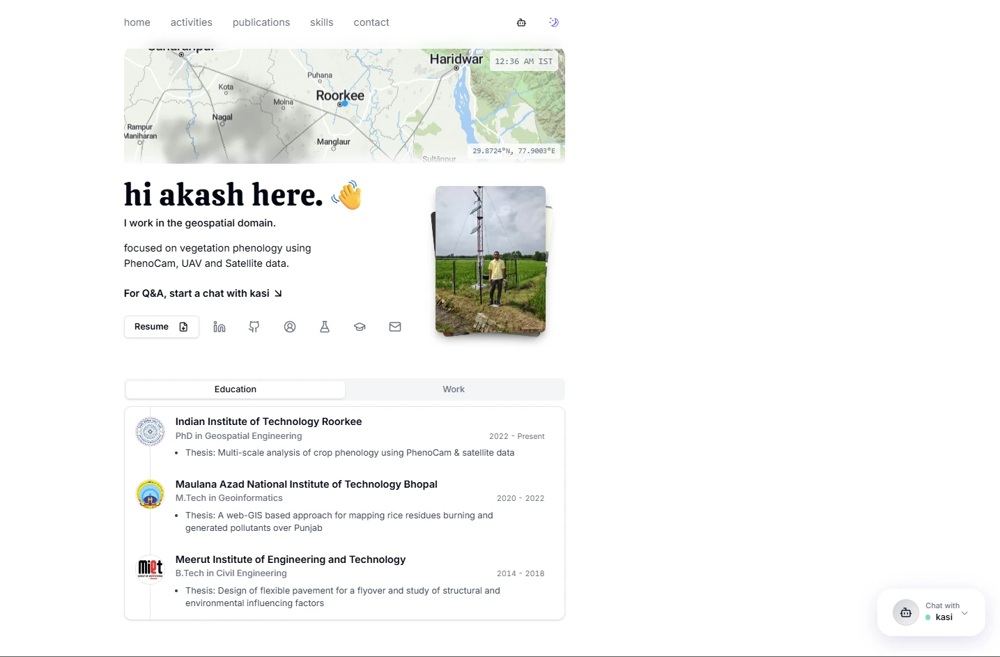

# akashpandey.com

My personal site — research, field work, publications, skills, contact.

Live at [www.akashpandey.com](https://www.akashpandey.com/)



## How it's built

Next.js (App Router), React, Tailwind, TypeScript. Deployed on Vercel.

Almost all the content sits in `src/data` as JSON or Markdown, and the photos
and CV are plain files in `public`. That way I can add a paper or a field trip
without opening a component. It's a bit old-fashioned compared to running a CMS,
but I edit this thing at odd hours and I'd rather not manage a database for
twenty JSON records.

A few pieces that aren't obvious from the file tree:

- The map on the contact page is MapLibre with OpenFreeMap vector tiles, plus an
  Esri imagery layer behind the satellite toggle. The line it draws between you
  and me is a great circle, not a route.
- Kasi, the chat thing in the corner, answers from `src/data/profile.md` and
  falls back to OpenRouter for anything it can't cover locally.
- The contact form goes out through Resend.
- The skill logos are generated. `scripts/colorize-skill-icons.mjs` builds a
  brand-coloured duotone of each one so a photo of a total station and a flat
  vector logo end up looking like they belong on the same page.

## The dog

There is a shiba standing on the Kasi window. It watches the cursor, perks up
when you hover it, hops if you click it, and you can pick it up and put it
anywhere. Let go and it falls until it lands on something — a heading, the rim
of a photo card, a table, the chat window — and then rides that thing as the
page scrolls. `src/lib/puppy/perch.ts` decides what counts as a surface; give
any element `data-puppy-perch` to add it.

The model is Quaternius's rigged shiba, CC0, via
[Poly Pizza](https://poly.pizza/m/y4wdQpg767). `npm run fetch-puppy` pulls it
and quantizes it down to 454KB. Quantization rather than Draco on purpose:
Draco lands at 361KB but wants a 245KB decoder next to it, so it is worse on
the only load that matters. Three.js reads quantized meshes with nothing extra.

Under `prefers-reduced-motion` the dog holds still — no idle loop, no wag, no
fall — but it will still turn its head to the cursor and can still be moved.

## Running it

Node and npm, then:

```bash
git clone https://github.com/ItsAkashPandey/akashpandey.com.git
cd akashpandey.com
npm install
cp .env.example .env.local
npm run dev
```

`npm run dev` picks the first free port from 3000 up and prints it — I had
something else squatting on 3000 for months and got tired of the collision. Set
`PORT` if you want a specific one, or `npm run dev:lan` to reach it from your
phone.

The pages all work with no keys at all. Kasi, the contact form and chat logging
need the values listed in `.env.example`.

Before I push:

```bash
npm run lint
npm run build
```

## Making it yours

Fork it, then swap out:

| What                         | Where                                             |
| ---------------------------- | ------------------------------------------------- |
| Papers, DOIs, figures        | `src/data/publications.json`                      |
| Talks, trips, workshops      | `src/data/activities.json`                        |
| Tools and instruments        | `src/data/skills.json`                            |
| Timeline                     | `src/data/career.json`, `src/data/education.json` |
| What Kasi knows about you    | `src/data/profile.md`                             |
| Privacy page                 | `src/data/privacy.md`                             |
| CV                           | `public/resume.pdf`                               |
| Colours, type, paper texture | `src/app/globals.css`                             |

Activity photos go in a folder under `public/`, then:

```bash
npx ts-node scripts/resolve-activity-images.ts   # rebuild the image lists
node scripts/optimize-images.mjs                 # shrink them before committing
```

Add a new skill logo to `public/skills/`, give it a `gradient` in
`skills.json`, and run `npm run colorize-skills`.

The site colours are HSL variables at the top of `globals.css`. Changing
`--background`, `--foreground` and the four `--surface-*` values re-themes the
whole thing.

## Deploying

Push to `main` and Vercel builds it. Set the environment variables there first.

The admin page reads `ADMIN_USERNAME`, `ADMIN_PASSWORD` and
`ADMIN_SESSION_SECRET`. No defaults — leave them unset and every login is
refused, which is the behaviour I wanted.

Chat logging needs a database or a Google Sheet; both are written up in
[docs/chat-logging.md](docs/chat-logging.md).

Don't commit `.env.local`.

## Thanks

[tedawf.com](https://tedawf.com/) — the whole shape of this site started there,
especially the stacked photo cards and the way the work is laid out. Thanks Ted.

[Quaternius](https://quaternius.com/) for the shiba, and for putting it in the
public domain. Details in `public/models/credits.json`.

## Elsewhere

[LinkedIn](https://www.linkedin.com/in/iamakashpandey/) ·
[GitHub](https://github.com/ItsAkashPandey) ·
[ORCID](https://orcid.org/0009-0009-0757-6276) ·
[Scholar](https://scholar.google.com/citations?user=wg6rG0cAAAAJ&hl=en)

## License

Code is [MIT](LICENSE.txt). The photos, CV and writing are mine — please don't
reuse those.
