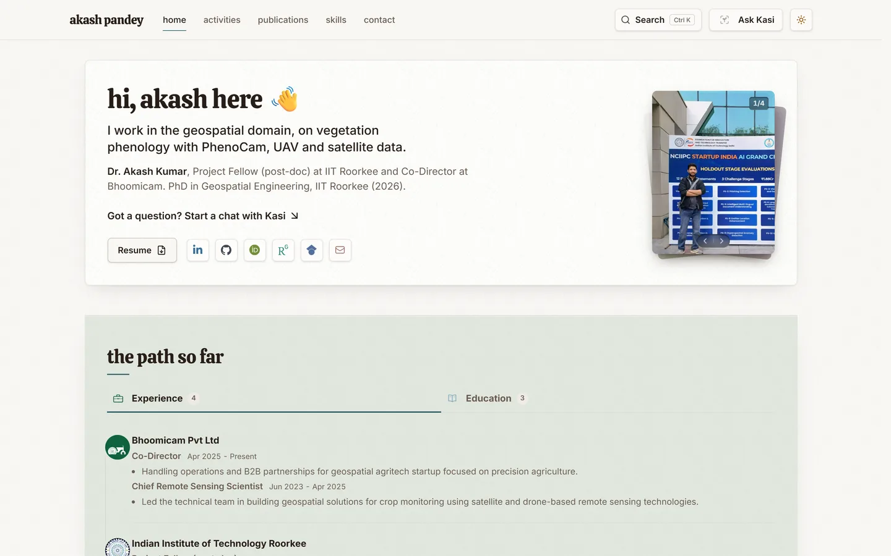

# akashpandey.com

My personal site — research, field work, publications, skills, contact.

Live at [www.akashpandey.com](https://www.akashpandey.com/)



## How it's built

Next.js (App Router), React, Tailwind, TypeScript. MapLibre for the contact
map, three.js for the globe on the home page. Deployed on Vercel.

Almost all the content sits in `src/data` as JSON or Markdown, and the photos
and CV are plain files in `public`. That way I can add a paper or a field trip
without opening a component. It's a bit old-fashioned compared to running a CMS,
but I edit this thing at odd hours and I'd rather not manage a database for a
hundred-odd JSON records.

A few pieces that aren't obvious from the file tree:

- The globe on the home page has a dot for every city I've studied, worked or
  travelled to for work. Its land mask is baked into
  `src/components/globe/land.ts`; rerun `node scripts/build-globe-land.mjs`
  only if the dot grid changes.
- The map on the contact page is MapLibre with OpenFreeMap vector tiles and Esri
  satellite imagery underneath (on by default, there's a toggle). It pins every
  activity, school and job location alongside home, and the line it draws
  between you and me is a great circle, not a route.
- The skill logos are generated. `scripts/colorize-skill-icons.mjs` builds a
  brand-coloured duotone of each one so a photo of a total station and a flat
  vector logo end up looking like they belong on the same page.

## Running it

Node and npm, then:

```bash
git clone https://github.com/ItsAkashPandey/akashpandey.com.git
cd akashpandey.com
npm install
cp .env.example .env.local
npm run dev
```

`npm run dev` gets the photos and the map's library files ready first, then picks
the first free port from 3000 up and prints it — I had something else squatting
on 3000 for months and got tired of the collision. Set `PORT` if you want a
specific one, or `npm run dev:lan` to reach it from your phone.

The pages all work with no keys at all. Kasi, the contact form and chat logging
need the values listed in `.env.example`.

Before I push:

```bash
npm run lint
npm test          # unit tests (vitest)
npm run build
```

`npm run test:e2e` runs the Playwright tests on the installed Edge.

## Content

Fork it, then swap out:

| What                       | Where                                             |
| -------------------------- | ------------------------------------------------- |
| Papers, DOIs, figures      | `src/data/publications.json`                      |
| Talks, trips, workshops    | `src/data/activities.json`                        |
| Places (map and globe)     | `src/data/places.json`                            |
| Tools and instruments      | `src/data/skills.json`                            |
| Timeline                   | `src/data/career.json`, `src/data/education.json` |
| Home page intro, portraits | `src/data/home.json`                              |
| Social links               | `src/data/socials.json`                           |
| What Kasi knows about you  | `src/data/profile.md`                             |
| Privacy page               | `src/data/privacy.md`                             |
| CV                         | `public/resume.pdf`                               |
| Colours, paper texture     | `src/app/globals.css`                             |

Add a new skill logo to `public/skills/`, give it a `gradient` in
`skills.json`, and run `npm run colorize-skills`.

The site colours are HSL variables at the top of `globals.css`. Changing
`--background`, `--foreground` and the four `--surface-*` values re-themes the
whole thing. Dark mode has its own set under `.dark`.

### Adding an activity

Easiest is to copy an existing entry in `activities.json` (anywhere in the
file, it gets sorted by `date`). The bits that matter:

- `slug` is its permanent URL (`/activities/<slug>`). Pick it once and don't
  change it later, old links would break.
- `place` is an id from `places.json`. If it's somewhere new, add it there with
  a `name`, `city` and `coordinates`. Coordinates are longitude first, the
  opposite of what Google Maps copies. `country` only if it isn't India.
- Photos go in a folder under `public/`, and `imageFolder` points at it. They're
  shown in number order, so I just call them `1.webp`, `2.webp` and so on.
- `"kind": "fieldwork"` is for a site visit, an installation or a survey rather
  than an event. Search engines then get the page as an article instead of an
  event. Leave it out for events.

The build checks the data as it goes, so a typo in a place id fails the build
instead of quietly dropping a pin off the map.

### Photos

`npm run images` puts small WebP copies of every photo into `public/_img`, plus
a tiny blurred preview of each. It already runs before `dev` and `build`
(`prebuild`). The output is git-ignored and cached, so after the first run it
only redoes new or changed photos.

Phone photos are huge, so before committing new ones I run
`node scripts/optimize-images.mjs --dry-run` to see what's oversized, then again
without the flag to shrink them (it also turns PNG/JPG logos into WebP).

## Kasi and the contact form

Kasi, the chat thing in the corner, is a small chatbot that answers questions
about me and my work. It needs at least one of `CEREBRAS_API_KEY`,
`GROQ_API_KEY`, `GEMINI_API_KEY` or `OPENROUTER_API_KEY`, and all four have
free tiers. It tries them in that order and moves on when one is rate limited,
down or slow. `KASI_PROVIDERS` changes the order.

What it knows comes from the same data files the pages use, plus
`src/data/profile.md` for whatever the JSON doesn't cover. Chat logs go to
Postgres or a Google Sheet, both written up in
[docs/chat-logging.md](docs/chat-logging.md).

The contact form goes out through Resend: `RESEND_API_KEY`, `CONTACT_FROM_EMAIL`
(needs a domain verified in Resend) and `CONTACT_TO_EMAIL`. Optional extras:

- Turnstile spam check: `NEXT_PUBLIC_TURNSTILE_SITE_KEY` and
  `TURNSTILE_SECRET_KEY`, both or neither.
- Upstash (`UPSTASH_REDIS_REST_URL`, `UPSTASH_REDIS_REST_TOKEN`) shares the rate
  limits across serverless instances. Vercel's Upstash integration sets them.

## Deploying

Push to `main` and Vercel builds it. Set the environment variables there first.

The admin page reads `ADMIN_USERNAME`, `ADMIN_PASSWORD` and
`ADMIN_SESSION_SECRET`. No defaults — leave them unset and every login is
refused, which is the behaviour I wanted.

Don't commit `.env.local`.

## Thanks

[tedawf.com](https://tedawf.com/) — the whole shape of this site started there,
especially the stacked photo cards and the way the work is laid out. Thanks Ted.

## Elsewhere

[LinkedIn](https://www.linkedin.com/in/iamakashpandey/) ·
[GitHub](https://github.com/ItsAkashPandey) ·
[ORCID](https://orcid.org/0009-0009-0757-6276) ·
[Scholar](https://scholar.google.com/citations?user=wg6rG0cAAAAJ&hl=en)

## License

Code is [MIT](LICENSE.txt). The photos, CV and writing are mine — please don't
reuse those.
